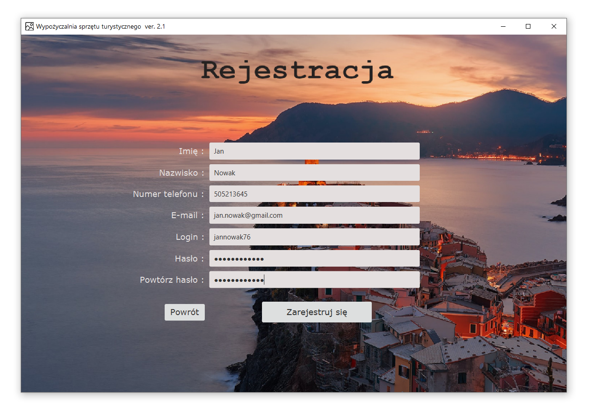
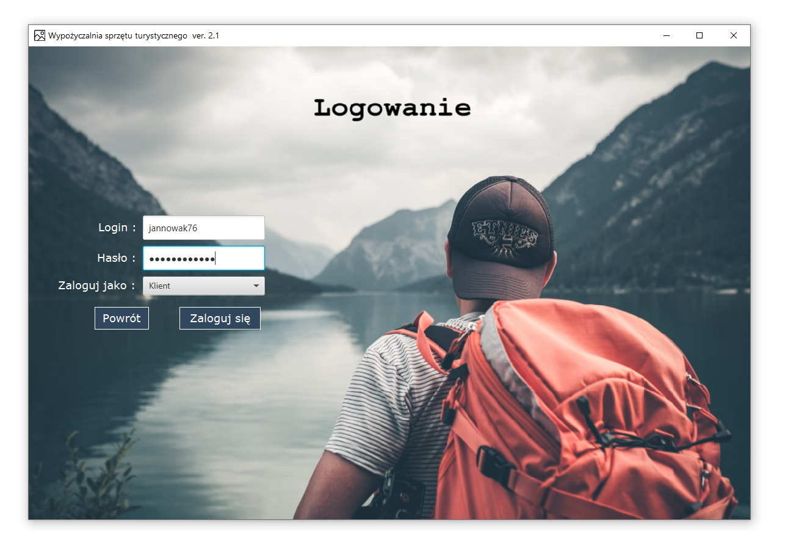
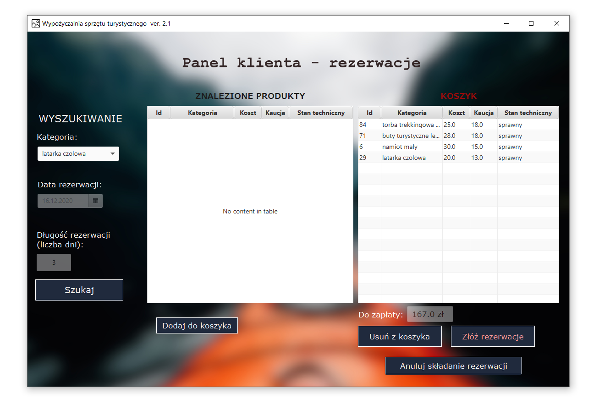
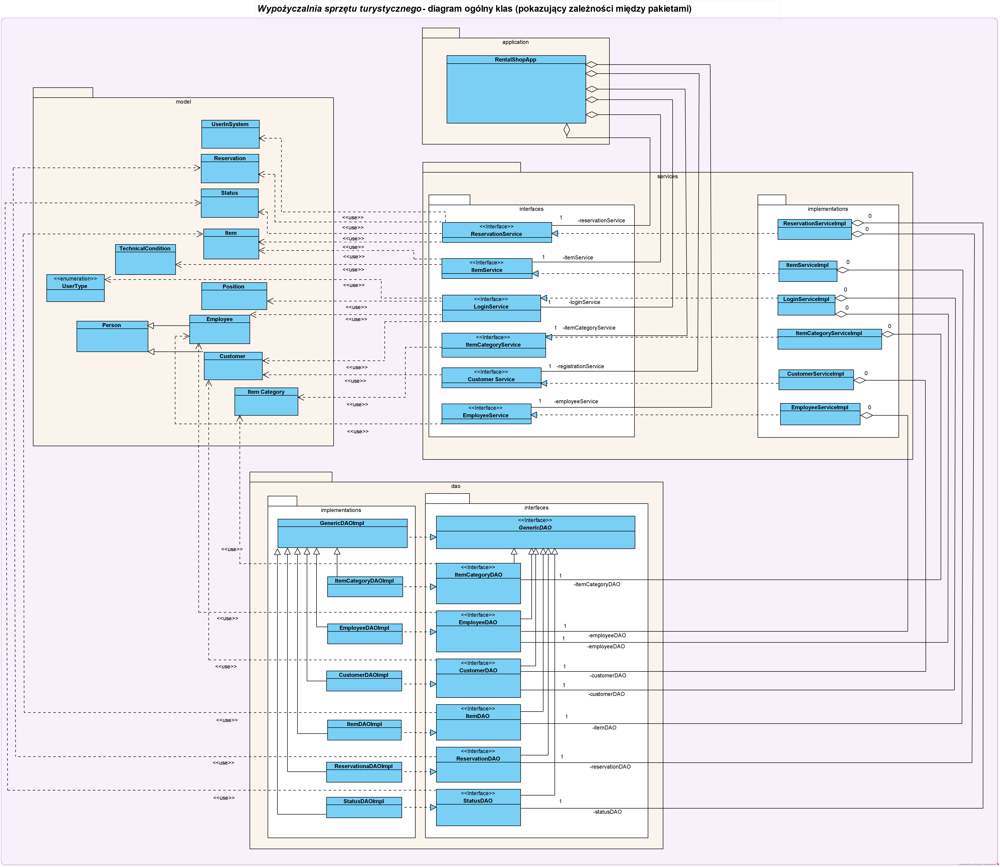

# Tourist Equipment Rental Shop

## Authors
- Patryk Fidrych
- Daniel Leśniewicz
- Mirosław Kuźniar

## Project description
The main goal of the project is to manage the tourist equipment rental shop.

## Technologies
Project is created with:
* Java 8 
* Hibernate
* JavaFx
* MySQL database
* Maven
----
tests:
* Mockito
* JUnit
* FitNesse

## Functionalities
User can:
* make a reservation (user gets e-mail notification)
* cancel a reservation
* register
* login

Worker can:
* add new categories
* add new items
* edit a reservation

## How to run app
Before you run  application you should edit `persistance.xml` file and set appropriate access data to the database.

## Screenshots
### Registration page

### Login page

### Reservation page

## App architecture

